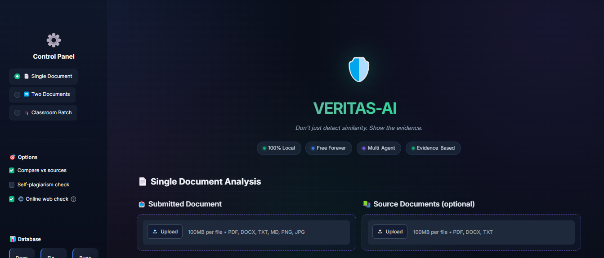
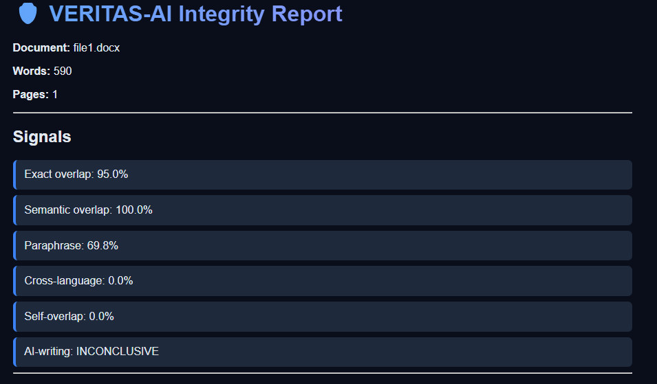

<div align="center">


\# 🛡️ VERITAS-AI


\### Local Multi-Agent Academic Integrity \& Research Forensics Engine


\*\*"Don't just detect similarity. Show the evidence."\*\*


\[!\[Python](https://img.shields.io/badge/python-3.11+-blue.svg)](https://www.python.org/)

\[!\[License](https://img.shields.io/badge/license-MIT-yellow.svg)](LICENSE)

\[!\[Local](https://img.shields.io/badge/100%25-Local-success.svg)](#)

\[!\[Free](https://img.shields.io/badge/Free-No%20APIs-brightgreen.svg)](#)


</div>


\---


\## 🎯 What is VERITAS-AI?

## 📸 Screenshots

### Dashboard


### Report


### Evidence Side-by-Side


A \*\*100% local, free, multi-agent\*\* academic integrity analyzer. Unlike traditional checkers that give one "87% plagiarism" score, VERITAS-AI gives \*\*evidence-based findings\*\* with full explanations.


\### ✨ Features


\- 📄 PDF/DOCX/TXT/Image parsing with OCR

\- 🎯 Exact copy detection (n-gram, MinHash, SimHash)

\- 🧠 Semantic plagiarism (embeddings)

\- 🔄 Paraphrase detection

\- 🌐 Cross-language (EN ↔ UR/HI/AR)

\- 📚 Self-plagiarism

\- 📖 Citation integrity

\- 🚨 Fake citation detection

\- 🤖 AI-writing signals

\- 🎭 AI-tool signatures (Gemini/ChatGPT/Claude)

\- ✍️ Stylometry

\- 🎓 Classroom batch

\- 🕸️ Collusion graph

\- 🔍 Source discovery

\- 🌐 Web plagiarism

\- ⚖️ Evidence fusion


\---


\## 🚀 Quick Start


\### Prerequisites


\- Python 3.11+

\- 8 GB RAM

\- Tesseract OCR (\[download](https://github.com/UB-Mannheim/tesseract/wiki))


\### Install


```bash

git clone https://github.com/YOUR\_USERNAME/VERITAS-AI.git

cd VERITAS-AI

python -m venv venv

venv\\Scripts\\activate

pip install -r requirements.txt

